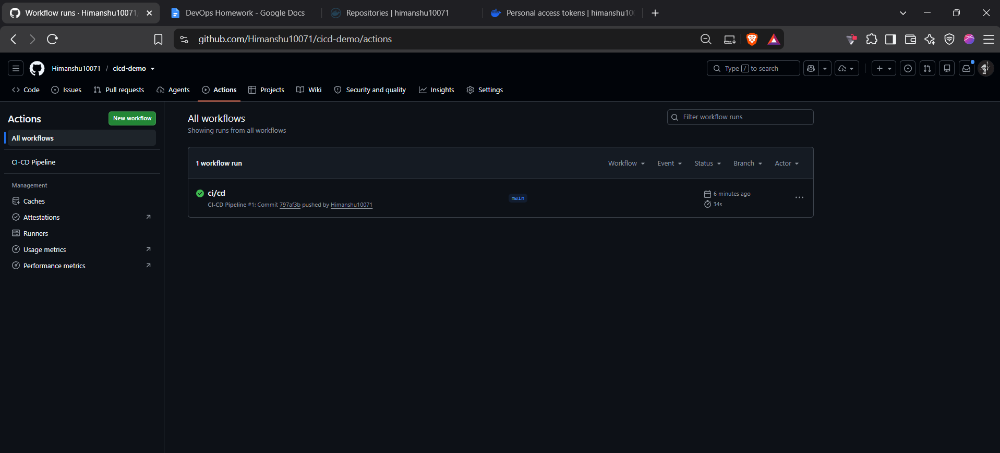
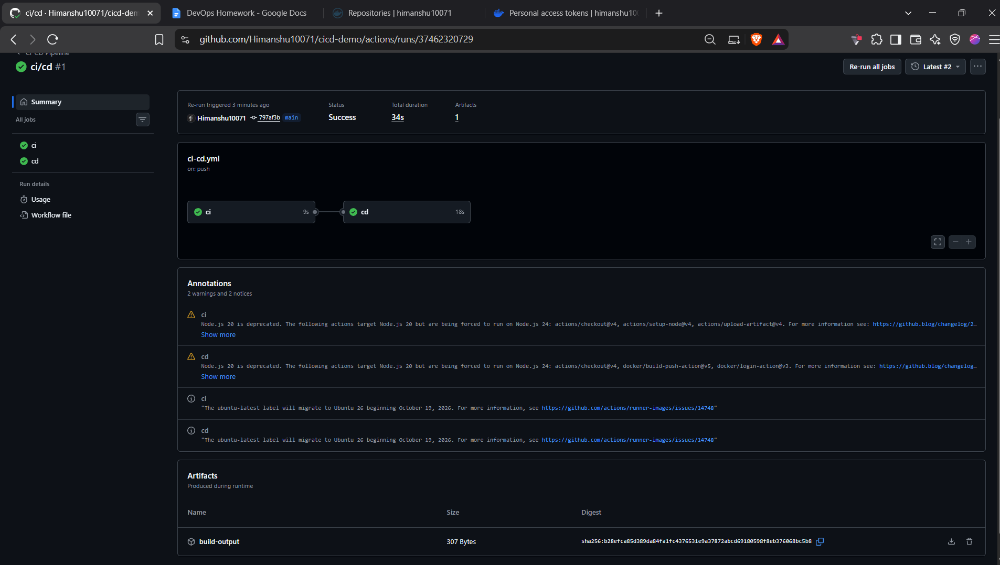
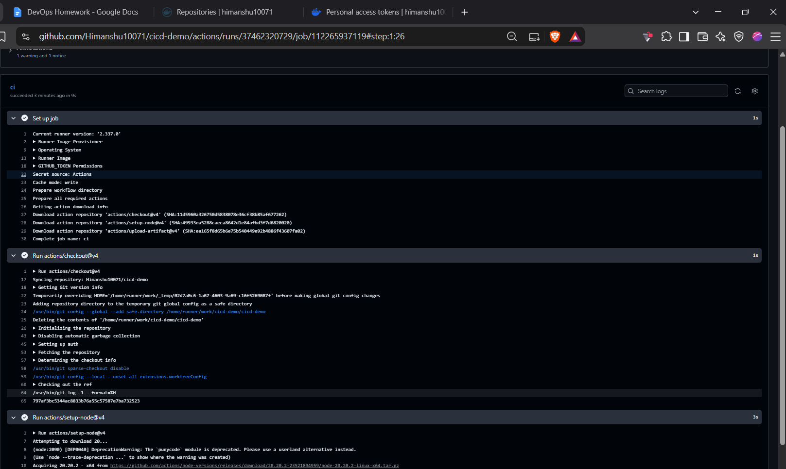
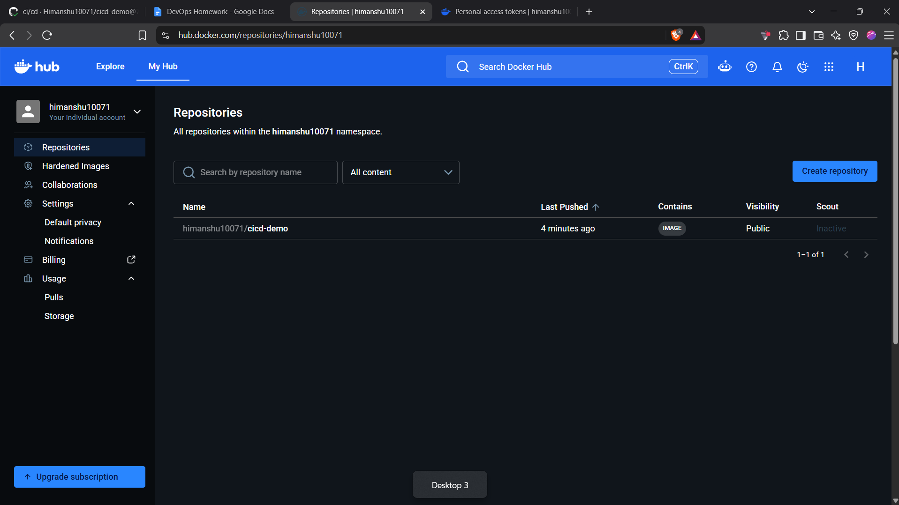

# CI/CD Demo with GitHub Actions

A small Node.js app with an automated CI/CD pipeline built on GitHub Actions.

## CI vs CD
- **CI (Continuous Integration):** every push is automatically built and tested so errors are caught early.
- **CD (Continuous Delivery/Deployment):** after CI passes, the app is automatically packaged and delivered (here, as a Docker image pushed to Docker Hub).

## Project Structure
- `app.js` – application source code
- `test.js` – tests
- `Dockerfile` – container image definition
- `.github/workflows/ci-cd.yml` – the pipeline

## GitHub Actions Concepts
- **Workflow:** the automation defined in a YAML file (`ci-cd.yml`), triggered on push to `main` and on pull requests.
- **Jobs:** independent units of work. This pipeline has two: `ci` and `cd`. `cd` uses `needs: ci`, so it only runs if CI succeeds.
- **Steps:** individual tasks inside a job (checkout, setup Node, run tests, build, etc.).
- **Runners:** the machines that execute jobs. We use GitHub-hosted `ubuntu-latest`.
- **Secrets:** sensitive values (`DOCKERHUB_USERNAME`, `DOCKERHUB_TOKEN`) stored in repo settings and read via `${{ secrets.NAME }}`, never hardcoded.
- **Artifacts:** files saved from a run. The `build-output` artifact contains the built `dist/` folder.

## Pipeline Stages
1. **Build:** `npm run build` creates the `dist/` output.
2. **Test:** `npm test` runs the test script.
3. **Artifact upload:** build output is stored with the run.
4. **CD:** a Docker image is built and pushed to Docker Hub as `YOUR_USERNAME/cicd-demo:latest`.

## Pipeline Execution
The pipeline runs automatically on each push to `main`.

## How to Run Locally
    npm test
    docker build -t cicd-demo .
    docker run -p 3000:3000 cicd-demo
